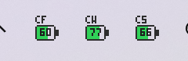

# claude-codex-battery-win

**Claude Code / Codex 사용량 한도를 Windows 작업표시줄 트레이에 배터리로 상시 표시** — WSL 환경용.

[dennykim123/claude-codex-battery](https://github.com/dennykim123/claude-codex-battery) (macOS SwiftBar 위젯)의 Windows/WSL 포트입니다.

*Windows tray port of the macOS SwiftBar widget — shows your Claude Code (and Codex) rate-limit headroom as battery icons in the system tray. Requires Claude Code running inside WSL.*



- **C5** = Claude 5시간 세션 남은 %
- **CW** = Claude 주간 전체 남은 %
- **CF** = 최상위 모델(Fable 등) 전용 주간 한도 남은 %
- **X5 / XW** = Codex 5시간·주간 — `~/.codex/sessions`가 있으면 자동 표시

색: 초록(≥50%) / 노랑(<50%) / 빨강(≤20%). 캡슐 안 숫자 = 남은 %.
마우스 오버 = 리셋까지 남은 시간 · **클릭 = 계정 줄세우기 팝업**(아래) · 우클릭 = 텍스트 상세/브라우저 라인업/새로고침/종료. 2분마다 갱신.

### 멀티 계정 + 다음 계정 추천

Claude 계정을 여러 개 번갈아 쓰는 경우, 아이콘을 **왼클릭하면 트레이 옆에 팝업**이 떠서 계정들이 크루원 캐릭터(계정마다 고정 색)로 우선순위 순서대로 줄을 서 있습니다 — 잔량만큼 몸이 아래서부터 채워지고, 추천 계정 = 왕관, 리셋 임박 = 말풍선, Fable 소진 계정 = 유령(유령도 태스크는 하니까 Opus/Sonnet용), 제외 계정 = 쓰러진 시체, 계정마다 Fable/주간/5h 미니 바. 바깥 클릭이나 Esc로 닫힙니다. 텍스트 상세는 우클릭 메뉴에 남아 있습니다.

계정은 3개 티어로 줄을 섭니다 (**잔량 10% 미만인 창은 "사실상 소진" 취급** — 그거 쓰려고 로그인할 가치가 없으므로 가치 계산에서 뺍니다):

1. **Fable 가능** — 최상위모델(Fable 등) 창이 10% 이상 남은 계정. Fable 잔량 큰 순.
2. **Fable 소진 — Opus/Sonnet 전용** — Fable은 바닥났지만 주간 창이 살아있는 계정. 주간 잔량 큰 순.
3. **제외 — 로그인 비효율** — 주간 창 자체가 10% 미만. 켜봐야 얻는 게 없는 계정.

- `★ 다음 추천 계정` — 2단 우선순위:
  1. **리셋 임박 소진(use-it-or-lose-it)**: 주간/최상위모델 창이 **24시간 내 리셋**인데 잔량이 15% 이상 남은 계정. 안 쓰면 그대로 증발하는 한도라 최우선(리셋 빠른 순). 단, 5시간 창이 소진됐거나 제외 티어인 계정은 빼고, **Fable이 소진된 계정이면 사유에 "Opus/Sonnet용"을 명시**합니다.
  2. 임박 계정이 없으면: Fable 티어 1순위 → 없으면 Opus 티어 1순위.
  목록에서 임박 계정엔 `⏳주간 52% 소멸임박(12h)` 식 표시가 붙습니다.
- **2D 라인업 🔋** — 트레이 우클릭 메뉴. 계정들을 배터리 캐릭터로 우선순위 순서대로 줄세운 페이지(`~/.claude/usage-widget/lineup.html`, 매 수집마다 갱신)를 브라우저로 엽니다. 추천 계정엔 👑, 리셋 임박엔 ⏰ 말풍선, 제외 계정은 누워 있습니다.
- **프로필 자동 관측** — `~/.claude-profiles/<계정>/`에 `CLAUDE_CONFIG_DIR` 프로필을 두고 계정을 전환하는 경우, collector가 각 프로필의 토큰으로 그 계정 한도를 함께 관측해 장부를 최신으로 유지합니다(만료 토큰은 조용히 스킵, 갱신·저장 없음 — 읽기 전용). 프로필이 없으면 기존과 동일하게 동작합니다.
- **소멸 임박 풍선 알림**: 리셋임박 소진 추천이 새로 발생하면 트레이가 Windows 풍선 알림을 1회 띄웁니다(같은 리셋 창당 1번).
- `--next` 마지막 줄에 Codex 잔량도 표시됩니다(창 길이 자동 판별: 5h/주간).
- 계정마다 마지막으로 측정된 5시간/주간/최상위모델 잔량 %와 리셋까지 남은 시간
- 리셋 시각이 이미 지난 창은 `리셋됨 → 100%`로 표시
- `▶` = 현재 로그인 계정(실시간), 나머지 = 전환 직전 마지막 스냅샷

별도 설정 없이, 각 계정으로 로그인한 상태에서 위젯이 한 번이라도 측정하면 그 계정이 목록에 등록됩니다. 계정을 전환(`/login`)해도 이전 계정의 마지막 잔량이 보존됩니다.

터미널에서 바로 보려면(트레이 없이도 동작):

```bash
node collector.mjs --next
```

```
[Fable 가능 — 이 순서로]
▶ 1. a@gmail.com  (현재 로그인)
    5h 92%·리셋 4h 51m 후 | 주간 80%·리셋 5d 23h 후 | Fable 70%·리셋 5d 23h 후
  2. b@gmail.com  (5m 전 관측)
    ...
[Fable 소진(<10%) — Opus/Sonnet 전용]
  3. c@gmail.com  (2d 3h 전 관측)  ⏳주간 46% 소멸임박(19h 27m)
    ...
[제외 — 주간 잔량 <10%, 로그인 비효율]
  d@gmail.com  (6d 1h 전 관측)
    ...
★ 다음 추천: a@gmail.com (1순위: Fable 70%·주간 80%)
```

## 요구사항

- Windows 10/11 + WSL2 (아무 배포판)
- WSL 안에 Node.js 18+ (`node` 명령)
- WSL 안에서 Claude Code 로그인 상태 (`~/.claude/.credentials.json` 존재)

## 설치

WSL 터미널에서:

```bash
git clone https://github.com/alibabagini-cyber/claude-codex-battery-win.git
cd claude-codex-battery-win
./install.sh
```

끝. 트레이에 배터리가 뜨고(~20초), 로그인 시 자동 시작이 등록됩니다.
아이콘이 안 보이면 트레이 ∧(오버플로)를 확인하세요 — 다음 재시작부터는 자동으로 표시줄에 고정됩니다(Win11).

## 동작 원리

```
[Windows 트레이]  tray.ps1 (PowerShell, NotifyIcon + 픽셀 렌더)
      │  2분마다: wsl.exe -d <distro> node collector.mjs
      ▼
[WSL]  collector.mjs
      ├─ Claude: ~/.claude/.credentials.json 의 OAuth 토큰으로
      │          Anthropic 공식 usage API(https://api.anthropic.com) 1콜
      └─ Codex : ~/.codex/sessions/**.jsonl 의 rate_limits 파싱 (로컬 파일만)
```

## 보안 / 프라이버시

- **네트워크는 `api.anthropic.com`(HTTPS) 단 한 곳** — Claude 한도 조회용. 그 외 어떤 서버로도 아무것도 보내지 않습니다. 자동 업데이트/텔레메트리 없음.
- OAuth 토큰은 collector 프로세스 안에서만 사용되며 **출력·로그·캐시에 절대 남지 않습니다**. 토큰 갱신도 하지 않습니다(읽기 전용) — 토큰이 만료되면 Claude Code를 쓰는 순간 자동으로 신선해집니다.
- 폴백 캐시 `~/.claude/usage-widget/usage-cache.json`(권한 600)에는 퍼센트·리셋시각만 저장됩니다. 계정별 장부 `accounts.json`(권한 600)에도 이메일 + 퍼센트·리셋시각·측정시각만 저장되며 **토큰은 저장하지 않습니다**.
- 레지스트리 쓰기는 트레이 아이콘 고정용 `HKCU\Control Panel\NotifyIconSettings\*\IsPromoted` 한 곳뿐입니다.
- 관리자 권한 불필요. 설치 산출물은 `%USERPROFILE%\claude-codex-battery\launch.vbs` + 시작프로그램 바로가기 2개가 전부입니다.

## 문제 해결

| 증상 | 확인 |
|---|---|
| 아이콘에 `?` | WSL에서 `node collector.mjs` 직접 실행 → `claudeError` 값 확인 |
| `http-401` | Claude Code를 한 번 실행해 토큰 갱신 |
| 아이콘이 안 뜸 | `powershell -ExecutionPolicy Bypass -File tray.ps1 -Once` (디버그 모드: 데이터·에러 출력) |
| 아이콘이 떴다가 1~2분 뒤 사라짐 | WSL 터미널에서 직접 띄운 경우 — WSL interop 자식은 세션 회수 때 함께 종료됨. `schtasks /Run /TN ClaudeCodexBatteryKick` (install.sh가 등록) 또는 재로그인으로 기동 |
| 상세창 ⚠ 표시 | API 일시 실패 → 마지막 캐시값 표시 중이라는 뜻 |

## 제거

1. 트레이 아이콘 우클릭 → 종료
2. 시작프로그램에서 `Claude Codex Battery.lnk` 삭제 (`Win+R` → `shell:startup`)
3. `%USERPROFILE%\claude-codex-battery\` 폴더와 클론한 repo 삭제

## 라이선스

MIT. 원작 [dennykim123/claude-codex-battery](https://github.com/dennykim123/claude-codex-battery) © Denny Kim — 배터리 렌더링 컨셉·Codex rate_limits 파싱 로직을 포팅했습니다.
